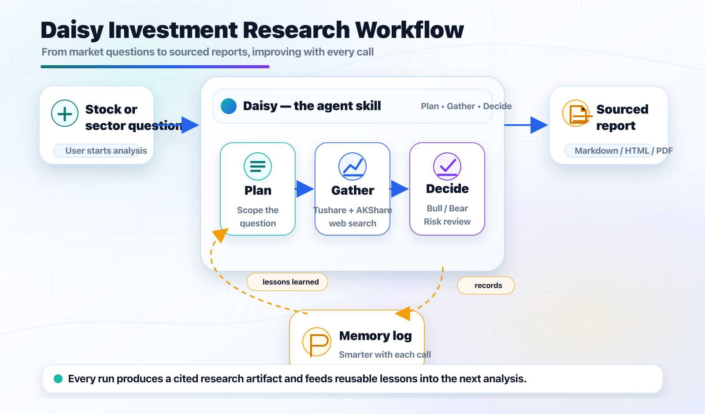

# Daisy Financial Research

> Stock research skill for AI agents. Plan → fetch → validate → report. A-share, HK, US.

[中文](README_CN.md) | [GitHub](https://github.com/Agents365-ai/daisy-financial-research) | [Releases](https://github.com/Agents365-ai/daisy-financial-research/releases)



---

## What you get

Point an agent at a stock, sector, or theme. Daisy turns it into the structured workflow of an analyst — and leaves an audit trail you can come back to.

Tangible deliverables, all written under `./financial-research/` in your cwd:

- **`reports/<ts>_<slug>.{md,html,pdf}`** — the sourced research note (markdown source + browser-ready HTML + optional PDF, CN/EN fonts handled).
- **`watchlists/<ts>_<preset>.{csv,json}`** — multi-factor screener output: dividend quality, value, growth, momentum, HK Stock Connect, and so on.
- **`scratchpad/<ts>.jsonl`** — every tool call, parameter, raw result, and assumption the agent made on this task. Replayable.
- **`memory/decision-log.md`** — append-only Markdown log of every Buy / Overweight / Hold / Underweight / Sell call across sessions, with `pending → resolved` lifecycle and a 2-4 sentence reflection on each closed call.
- **`universes/<date>_hk-connect-universe.csv`** — Southbound Stock Connect (港股通) universe snapshot.

## How the workflow runs

When a user asks "deep-dive on Mao Tai" / "DCF for HSBC" / "find me A-share dividend names with quality":

1. **Memory pull.** `dexter_memory_log.py context --ticker <X>` injects past calls on the same ticker (with realized alpha) into the plan step. Past mistakes inform the current call.
2. **Plan.** The agent writes a 3–7 step plan into a per-task JSONL scratchpad before touching any data source.
3. **Data routing.** Suffix-based: `*.SH/SZ/BJ` → Tushare `pro.daily` / `pro.daily_basic` / `pro.fina_indicator` / `pro.income` / etc.; `*.HK` → Tushare `pro.hk_daily` plus AKShare for the documented `pro.hk_daily_basic` gap; bare US ticker → yfinance. The full primary + fallback table lives in `references/data-source-routing.md`.
4. **Soft loop limits.** Before each tool call, `dexter_scratchpad.py can-call <tool> <query>` flags two failure modes: (a) the same tool already called ≥ N times this task, (b) a textually similar query was already issued. It's a warning, not a block — the agent decides what to do.
5. **Computation.** DCF with sensitivity matrix for normal companies. **For banks / insurers / financial-sector names, daisy automatically skips DCF and uses RoTE / CET1 / NIM / P/B / payout instead** — DCF is the wrong frame for them, but most native agents miss this. Technical indicators (SMA / MACD / RSI / Bollinger / ATR) via `scripts/technical_indicators.py`, with a look-ahead-bias guard built in: rows newer than `--as-of` are dropped before the indicator engine sees the data, so backtests cannot peek at the future.
6. **Numerical validation.** Hard checklist: units, currency, period, per-share denominators, market-cap date, ranking universe. Failures are surfaced, not silently fudged.
7. **Bull / Bear / Synthesis** (optional, for balanced single-name research). Three-prompt template with an explicit round-counter loop spec; the synthesis output uses the canonical 5-tier rating that drops straight into the memory log.
8. **Report.** `scripts/financial_report.py` renders the Markdown source to HTML, then optionally to PDF. Structured sections: scope → data → price/valuation → financial drivers → news/catalysts → bull/base/bear → risks → evidence tables → disclaimer.
9. **Decision log.** The final call is recorded as a *pending* entry. Later, `dexter_memory_log.py auto-resolve` fetches close prices on `decision_date` and `as_of_date`, picks the right benchmark (CSI 300 for A-share, HSI for HK with AKShare Sina fallback, SPY for US), computes realized alpha + holding days, and closes the entry with the agent's reflection.
10. **Track-record audit.** `dexter_memory_log.py backtest` aggregates resolved entries over a window: per-rating mean alpha, hit rate, alpha t-stat, annualized alpha, Sortino-flavored ratio, plus the cumulative-alpha curve and its max drawdown. Honestly *not* called Sharpe — daisy logs decisions, not a continuous NAV.

## What's actually different

| Concern | Rolling your own | With daisy |
|---|---|---|
| Plan written down before data calls | Often skipped | Always — JSONL scratchpad on disk |
| Same endpoint hit 5× with similar args | Common failure mode | `can-call` warns *before* it happens (`difflib`-based, no embeddings) |
| Past calls on the same ticker | Forgotten across sessions | `memory_log context` injects them at plan time |
| Bank valued via DCF (wrong frame) | Hit-or-miss | Auto-override to RoTE / CET1 / NIM / P/B |
| `pro.hk_daily_basic` returns `请指定正确的接口名` | Surprise outage | Documented gap with AKShare fallback wired |
| Look-ahead bias in technical indicators | Easy to introduce silently | Rows newer than `--as-of` filtered before stockstats sees them |
| LLM emits `**Rating**: Buy` instead of `Buy` | Silent default to Hold | Tolerant extraction; loud rejection if no 5-tier word found |
| Hit rate across 50 prior calls | Manual spreadsheet | `memory_log backtest` (alpha t-stat, hit rate, max-DD) |
| Sourced report (CN+EN fonts, tables, sensitivity matrix, footnotes) | Manual every time | One command, three layers |
| Agent integration (JSON envelope, schema introspection, dry-run) | Manual subprocess plumbing | Built into every script — branch on `error.code`, not parsed prose |

## Quick start

```bash
export TUSHARE_TOKEN=...   # required for any A-share/HK Tushare call

# A-share dividend-quality watchlist + a rendered report
python <skill-dir>/scripts/screen_a_share.py --preset a_dividend_quality --top 50 --report
python <skill-dir>/scripts/financial_report.py ./financial-research/reports/<latest>.md \
    --title "A-share dividend watchlist" --slug a-div --pdf

# Point-in-time technical indicators (look-ahead-bias guarded)
python <skill-dir>/scripts/technical_indicators.py \
    --ts-code 600519.SH --as-of 20260415 --indicators rsi,macd,boll

# Zero-API HK ticker → Chinese name lookup
python <skill-dir>/scripts/akshare_hk_valuation.py name --ts-code 00700.HK

# Audit your decision track record
python <skill-dir>/scripts/dexter_memory_log.py backtest
```

Every script accepts `--out-dir <root>` to override the default `./financial-research/` location.

## Installation

| Platform | Global | Project |
|---|---|---|
| Claude Code | `git clone https://github.com/Agents365-ai/daisy-financial-research.git ~/.claude/skills/daisy-financial-research` | `git clone ... .claude/skills/daisy-financial-research` |
| Opencode | `git clone ... ~/.config/opencode/skills/daisy-financial-research` | `git clone ... .opencode/skills/daisy-financial-research` |
| OpenClaw / ClawHub | `clawhub install daisy-financial-research` | `git clone ... skills/daisy-financial-research` |
| Hermes | `git clone ... ~/.hermes/skills/research/daisy-financial-research` | via `external_dirs` in `~/.hermes/config.yaml` |
| OpenAI Codex | `git clone ... ~/.agents/skills/daisy-financial-research` | `git clone ... .agents/skills/daisy-financial-research` |
| SkillsMP | `skills install daisy-financial-research` | — |

```bash
# Core
pip install tushare pandas requests

# Optional extras
pip install akshare      # HK PE/PB/PS + ROE/EPS fallback (no Tushare token)
pip install yfinance     # US tickers (technical_indicators / auto-resolve)
pip install stockstats   # technical_indicators.py

# PDF rendering
brew install pandoc && brew install --cask basictex
```

Or with `uv`: `uv sync --all-extras`.

## Scripts at a glance

| Script | Purpose |
|---|---|
| `dexter_scratchpad.py` | Per-task JSONL of every tool call. `can-call` warns before repeat calls |
| `dexter_memory_log.py` | Cross-session decision log: `record` / `resolve` / `list` / `context` / `stats` / `backtest` / `compute-returns` / `auto-resolve` |
| `screen_a_share.py` | A-share multi-factor screener with named presets (dividend, value, quality, momentum) |
| `screen_hk_connect.py` | HK Stock Connect screener (only when 港股通 is explicitly requested) |
| `hk_connect_universe.py` | Southbound Stock Connect universe export with date back-fill |
| `akshare_hk_valuation.py` | HK PE/PB/PS + ROE/EPS/BPS via AKShare; `name` for zero-API local-dict lookup |
| `technical_indicators.py` | Point-in-time SMA/EMA/MACD/RSI/Bollinger/ATR/VWMA, look-ahead-bias guarded |
| `financial_report.py` | Markdown → HTML → optional PDF report renderer with CN/EN font fallback |

**Agent-native CLI contract** — every script supports:
- `--schema` — JSON parameter spec for agent introspection (preferred over `--help`)
- `--dry-run` — preview the request shape without any upstream call or file write
- `--format json|table` — auto-JSON when stdout is not a TTY; `DAISY_FORCE_JSON=1` to override
- Structured exit codes: `0` ok · `1` runtime · `2` auth · `3` validation · `4` no_data · `5` dependency
- Stable success / error envelopes: `{ok, data, meta}` / `{ok: false, error: {code, message, retryable, context}, meta}`

## Reference docs

The agent reads these from `references/` when the workflow needs them:

- `data-source-routing.md` — canonical (market × data type) routing table
- `hk-ticker-name.json` — curated HK ticker → Chinese-name dict
- `stock-screening-presets.md` — registry of screening presets
- `technical-indicator-cheatsheet.md` — 11-indicator selection guide
- `debate-prompts.md` / `risk-debate-prompts.md` — Bull/Bear/Synthesis + Aggressive/Conservative/Neutral templates with explicit loop specs
- `decision-schema.md` — 5-tier rating vocabulary + markdown render contract
- `reflection-prompt.md` — fixed-shape reflection prompt for memory-log resolve
- `cn-market-analyst-prompts.md` — China-market analyst framing (涨跌停 / 北向资金 / 板块轮动)
- `position-sizing.md`, `hsbc-hk-bank-research-test-20260429.md` — sizing recipe + bank valuation worked example

## Auto-update

The skill checks `<skill-dir>/.last_update` once per conversation. If the file is missing or older than 24 hours, daisy silently runs `git pull --ff-only`. Failures (offline, conflict, not a git checkout) are ignored without interrupting the workflow.

## Disclaimer

Data analysis and research records, not investment advice. All conclusions require independent judgement against the latest public information.

## Support

If this skill helps you, consider supporting the author:

<table>
  <tr>
    <td align="center">
      
      <br>
      <b>WeChat Pay</b>
    </td>
    <td align="center">
      
      <br>
      <b>Alipay</b>
    </td>
    <td align="center">
      
      <br>
      <b>Buy Me a Coffee</b>
    </td>
    <td align="center">
      
      <br>
      <b>Give a Reward</b>
    </td>
  </tr>
</table>

## Author

- Bilibili: https://space.bilibili.com/1107534197
- GitHub: https://github.com/Agents365-ai
