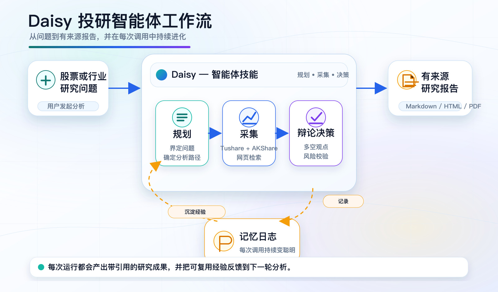

# Daisy 金融研究

> 给 AI agent 用的股票研究 skill。计划 → 取数 → 校验 → 出报告。覆盖 A 股、港股、美股。

[English](README.md) | [GitHub](https://github.com/Agents365-ai/daisy-financial-research) | [Releases](https://github.com/Agents365-ai/daisy-financial-research/releases)



---

## 你最终拿到什么

把一只股票、一个板块或一个主题丢给 agent，daisy 把它变成一个有结构的分析师工作流，并且**留下一份你随时能回头查的审计轨迹**。

落到磁盘上的产出 (默认全部在当前目录的 `./financial-research/` 下)：

- **`reports/<时间戳>_<slug>.{md,html,pdf}`** —— 带来源引用的研究报告 (Markdown 源 + 浏览器即开即看的 HTML + 可选 PDF，CSS 已处理中英文字体回退)
- **`watchlists/<时间戳>_<preset>.{csv,json}`** —— 多因子筛选输出：股息质量、价值、成长、动量、港股通等
- **`scratchpad/<时间戳>.jsonl`** —— 这次任务里 agent 调用的每一个工具、参数、原始结果、假设。**可重复**
- **`memory/decision-log.md`** —— 跨会话的追加式决策日志，每一笔 Buy / Overweight / Hold / Underweight / Sell 评级都有 `pending → resolved` 生命周期，每个 closed 条目带 2-4 句话的反思
- **`universes/<日期>_hk-connect-universe.csv`** —— 南向港股通 universe 快照

## 工作流是怎么跑的

当用户说"深度研究茅台"/"给汇丰做个 DCF"/"筛一批 A 股股息质量股"时：

1. **拉记忆。** `dexter_memory_log.py context --ticker <X>` 把同一只票过去的研究记录 (含已 resolve 的实际超额收益) 注入到 plan 步骤。**让过去的错误指导这次决策。**
2. **写计划。** Agent 在动任何数据源之前，先把 3-7 步的研究计划写进每任务一份的 JSONL scratchpad。
3. **路由取数。** 按代码后缀分流：`*.SH/SZ/BJ` → Tushare `pro.daily` / `pro.daily_basic` / `pro.fina_indicator` / `pro.income` 等；`*.HK` → Tushare `pro.hk_daily` 加上 AKShare 兜底 (因为 `pro.hk_daily_basic` 在本环境返回 `请指定正确的接口名`)；裸代码 → yfinance。完整的主源 + 兜底链表见 `references/data-source-routing.md`。
4. **软循环上限。** 每次工具调用前，`dexter_scratchpad.py can-call <tool> <query>` 会预警两种典型故障：(a) 同一个工具本任务已经被调用 ≥ N 次；(b) 这次的查询和之前某次很像。**这是软警告不是硬阻断**——agent 自己决定怎么应对。
5. **算估值。** 普通公司：DCF + 敏感性矩阵。**银行/保险/金融板块：daisy 自动跳过 DCF，改用 RoTE / CET1 / NIM / P/B / 派息率**——DCF 对金融股是错的口径，但原生 agent 经常在这上面翻车。技术指标 (SMA / MACD / RSI / Bollinger / ATR) 通过 `scripts/technical_indicators.py`，**内置 look-ahead-bias 守卫**：`Date > --as-of` 的行在 stockstats 拿到数据之前就被裁掉了，回测看不到未来。
6. **数值校验。** 硬性 checklist：单位、币种、期间口径、每股分母、市值日期、排名 universe。**不通过就显式标出来，不会偷偷糊弄。**
7. **多空辩论 (可选，给单股深度报告用)。** 三段式 prompt 模板 + 明确的轮次状态机；synthesis 输出用规范的 5 档评级，能直接落进决策日志。
8. **出报告。** `scripts/financial_report.py` 把 Markdown 源渲染成 HTML，可选再到 PDF。规整的章节结构：scope → data → price/valuation → financial drivers → news/catalysts → bull/base/bear → risks → evidence tables → 免责声明。
9. **写决策日志。** 最终评级以 *pending* 状态记入决策日志。日后 `dexter_memory_log.py auto-resolve` 自动取 `decision_date` 和 `as_of_date` 的收盘价、按市场选对应基准 (A 股 → CSI 300、港股 → HSI 经 AKShare Sina 兜底、美股 → SPY)、算实际 alpha + 持仓天数，并把 entry 改写为 resolved + 写入反思。
10. **战绩审计。** `dexter_memory_log.py backtest` 在指定窗口聚合所有已 resolve 条目：每 rating 桶的均值 alpha、命中率、`alpha_t_stat`、年化 alpha、Sortino-flavored 比率，加上累计 alpha 曲线和它的最大回撤。**故意不叫 Sharpe**——日志记的是离散决策不是连续 NAV，命名上就把这点说清楚。

## 它和你自己组合工具的差别在哪

| 关注点 | 自己组合 | 用 daisy |
|---|---|---|
| 取数前先写计划 | 经常跳过 | 永远先写——JSONL scratchpad 落盘 |
| 同一个端点被调 5 次只换一点点参数 | 经典翻车 | `can-call` 在调用**之前**就警告 (`difflib`，无 embedding 依赖) |
| 同一只票上次研究的结论 | 跨会话忘个干净 | `memory_log context` 在 plan 时自动注入 |
| 银行用 DCF 估值 (口径错) | 看运气 | 自动改用 RoTE / CET1 / NIM / P/B |
| `pro.hk_daily_basic` 接口"消失" | 突发故障 | 已记录的 gap，AKShare 兜底已接好 |
| 技术指标里的 look-ahead bias | 容易悄无声息地引入 | `Date > --as-of` 的行在 stockstats 拿到之前就裁掉 |
| LLM 输出 `**Rating**: Buy` 而不是规范 `Buy` | 静默落到 Hold 默认值 | 容错抽取；完全没 5 档评级词时**显式拒绝** |
| 50 笔历史决策的命中率 | 手工 Excel | `memory_log backtest` (alpha t-stat、命中率、最大回撤) |
| 带来源的研报排版 (中英文字体、表格、敏感性矩阵、注脚) | 每次手工调 | 一行命令出三层产物 |
| Agent 集成 (JSON envelope、schema 内省、dry-run) | 自己写一堆 subprocess 胶水 | 每个脚本内置——基于 `error.code` 分支，无需解析 prose |

## 快速开始

```bash
export TUSHARE_TOKEN=...   # 任何 A 股/港股 Tushare 调用都需要

# A 股股息质量 watchlist + 渲染成报告
python <skill-dir>/scripts/screen_a_share.py --preset a_dividend_quality --top 50 --report
python <skill-dir>/scripts/financial_report.py ./financial-research/reports/<latest>.md \
    --title "A 股股息 watchlist" --slug a-div --pdf

# 时点安全的技术指标 (look-ahead-bias 守卫)
python <skill-dir>/scripts/technical_indicators.py \
    --ts-code 600519.SH --as-of 20260415 --indicators rsi,macd,boll

# 港股 ticker → 中文名零 API 本地查询
python <skill-dir>/scripts/akshare_hk_valuation.py name --ts-code 00700.HK

# 审计自己的决策战绩
python <skill-dir>/scripts/dexter_memory_log.py backtest
```

任何脚本都接受 `--out-dir <root>` 来覆盖默认的 `./financial-research/` 目录。

## 安装

| 平台 | 全局 | 项目级 |
|---|---|---|
| Claude Code | `git clone https://github.com/Agents365-ai/daisy-financial-research.git ~/.claude/skills/daisy-financial-research` | `git clone ... .claude/skills/daisy-financial-research` |
| Opencode | `git clone ... ~/.config/opencode/skills/daisy-financial-research` | `git clone ... .opencode/skills/daisy-financial-research` |
| OpenClaw / ClawHub | `clawhub install daisy-financial-research` | `git clone ... skills/daisy-financial-research` |
| Hermes | `git clone ... ~/.hermes/skills/research/daisy-financial-research` | 通过 `~/.hermes/config.yaml` 的 `external_dirs` |
| OpenAI Codex | `git clone ... ~/.agents/skills/daisy-financial-research` | `git clone ... .agents/skills/daisy-financial-research` |
| SkillsMP | `skills install daisy-financial-research` | — |

```bash
# 核心
pip install tushare pandas requests

# 可选 extras
pip install akshare      # 港股 PE/PB/PS + ROE/EPS 兜底 (无需 Tushare token)
pip install yfinance     # 美股 ticker (technical_indicators / auto-resolve)
pip install stockstats   # technical_indicators.py

# PDF 输出
brew install pandoc && brew install --cask basictex
```

或者直接 `uv sync --all-extras`。

## 脚本一览

| 脚本 | 作用 |
|---|---|
| `dexter_scratchpad.py` | 单任务 JSONL，记录每次工具调用。`can-call` 子命令在调用前预警重复 |
| `dexter_memory_log.py` | 跨会话决策日志：`record` / `resolve` / `list` / `context` / `stats` / `backtest` / `compute-returns` / `auto-resolve` |
| `screen_a_share.py` | A 股多因子筛选 (预设驱动：股息、价值、质量、动量) |
| `screen_hk_connect.py` | 港股通筛选 (仅在用户明确要求 港股通 时使用) |
| `hk_connect_universe.py` | 南向港股通 universe 导出，自带日期回填 |
| `akshare_hk_valuation.py` | 港股 PE/PB/PS + ROE/EPS/BPS via AKShare；`name` 子命令做零 API 本地字典查询 |
| `technical_indicators.py` | 时点安全的 SMA/EMA/MACD/RSI/Bollinger/ATR/VWMA，含 look-ahead-bias 守卫 |
| `financial_report.py` | Markdown → HTML → 可选 PDF 报告渲染，CSS 已含中英文字体回退 |

**Agent-native CLI 契约**——每个脚本都支持：
- `--schema`——给 agent 内省的 JSON 参数规格 (优先于解析 `--help`)
- `--dry-run`——预演请求形状，不调用上游 API、不写文件
- `--format json|table`——stdout 不是 TTY 时自动 JSON；`DAISY_FORCE_JSON=1` 强制
- 结构化退出码：`0` 成功 · `1` 运行时 · `2` 认证 · `3` 参数 · `4` 无数据 · `5` 依赖
- 稳定的成功/错误 envelope：`{ok, data, meta}` / `{ok: false, error: {code, message, retryable, context}, meta}`

## 参考文档

Agent 在工作流需要的时候按需读取 `references/` 下的这些文档：

- `data-source-routing.md`——三市场数据源路由表 (主源 + 兜底链)
- `hk-ticker-name.json`——港股 ticker → 中文名字典
- `stock-screening-presets.md`——筛选预设注册表
- `technical-indicator-cheatsheet.md`——11 个指标的选用指南
- `debate-prompts.md` / `risk-debate-prompts.md`——多空/综合 + 激进/保守/中立辩论模板，含明确的轮次 Loop spec
- `decision-schema.md`——5 档评级词表 + Markdown 输出契约
- `reflection-prompt.md`——固定形状的反思 prompt
- `cn-market-analyst-prompts.md`——A 股/港股市场分析框架 (涨跌停 / 北向资金 / 板块轮动)
- `position-sizing.md`、`hsbc-hk-bank-research-test-20260429.md`——仓位推荐配方 + 银行估值实战

## 自动更新

技能在每次会话首次调用时检查 `<skill-dir>/.last_update`，超过 24 小时则静默 `git pull --ff-only`。失败 (离线 / 冲突 / 非 git checkout) 不打断流程。

## 免责声明

本技能仅产出数据分析和研究记录，**不构成投资建议**。所有结论需结合最新公开信息独立判断。

## 支持作者

如果这个 skill 对你有帮助，欢迎支持作者：

<table>
  <tr>
    <td align="center">
      
      <br>
      <b>微信支付</b>
    </td>
    <td align="center">
      
      <br>
      <b>支付宝</b>
    </td>
    <td align="center">
      
      <br>
      <b>Buy Me a Coffee</b>
    </td>
    <td align="center">
      
      <br>
      <b>打赏</b>
    </td>
  </tr>
</table>

## 作者

- Bilibili: https://space.bilibili.com/1107534197
- GitHub: https://github.com/Agents365-ai
